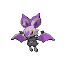
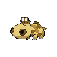
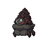
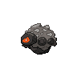
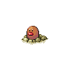
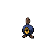
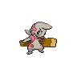

# Galar Mine

| Area | Pokemon | | | | | |
        | :--: | :--: | :--: | :--: | :--: | :--: | :--: |
        | Cave Normal  Lv.  |   [Machop](/pokemon-sword-and-shield-ultimate/pokemon/066-machop)  12% |   [Noibat](/pokemon-sword-and-shield-ultimate/pokemon/737-noibat)  12% |   [Hippopotas](/pokemon-sword-and-shield-ultimate/pokemon/456-hippopotas)  12% |   [Carkol](/pokemon-sword-and-shield-ultimate/pokemon/869-carkol)  12% |   [Rolycoly](/pokemon-sword-and-shield-ultimate/pokemon/868-rolycoly)  12% |   [Diglett](/pokemon-sword-and-shield-ultimate/pokemon/050-diglett)  12% 
| |   [Roggenrola](/pokemon-sword-and-shield-ultimate/pokemon/540-roggenrola)  12% |   [Timburr](/pokemon-sword-and-shield-ultimate/pokemon/548-timburr)  12% |

        